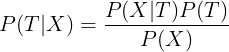
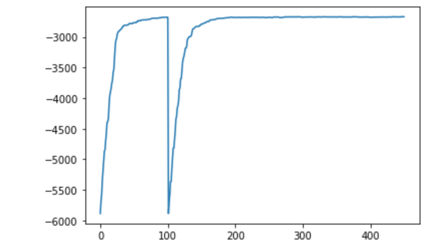

Introduction
------------

In this cookbook entry I will briefly explain how bayesian phylogenetic inference works.
Then I will show how one can perform it in BioPython on a simple example: mitochondrial sequences of primates.

Bayesian inference
------------------

All of the bayesian inference is built upon Bayes theorem, which calculates the posterior probability of
the model given the data:



In phylogenetic setting, the T would mean a tree topology, branch lengths and
evolution model parameters, and X the data (for example a multiple sequence alignment).

Because of the enormous amount of possible tree topologies with given number of taxa
(not to mention other parameters such as branch lengths), 
the exact calculation of the posterior probability is impossible.
A common technique that solves this problem is Markov Chain Monte Carlo (MCMC), which
allows sampling from the posterior distribution. This in turn makes it possible to approximate
the probability of a tree given the data by counting how many times each tree was sampled.
 
The algorithm works as follows:

1. Start with some tree T<sub>i</sub> (could be a random tree, or a tree generated by some simpler method, e.g. UPGMA).
2. Calculate its likelihood L<sub>i</sub> (probability that the data was generated by this tree).
3. Make a small change to a tree according to some probability distribution q(T<sub>j</sub>, T<sub>i</sub>) and calculate the likelihood L<sub>j</sub> of the new tree T<sub>j</sub>.
4. Calculate the ratio R = <sup>L<sub>j</sub>q(T<sub>j</sub>, T<sub>i</sub>)</sup>&frasl;<sub>L<sub>i</sub>q(T<sub>i</sub>, T<sub>j</sub>)</sub>
where q(T<sub>j</sub>, T<sub>i</sub>)/q(T<sub>i</sub>, T<sub>j</sub>) is called a Hastings ratio and often equals one.
5. If R > 1, T<sub>j</sub> is accepted as a current tree.
6. If R < 1, T<sub>j</sub> is accepted as a current tree with probability R, otherwise the current tree stays the same.
7. Repeat steps 3-7 a desired number of times.

It can be shown that the algorithm converges to an underlying distribution,
although it is usually difficult to predict when the convergence starts.

Code examples
-------------

The first thing that is needed in bayesian (and ML) phylogenetic inference is the model of evolution.
Currently there are two models of evolution implemented: Felsenstein81 (`Bio.Phylo.EvolutionModel.F81`),
which models only the stationary distribution of nucleotides,
and General Time Reversible model (`Bio.Phylo.EvolutionModel.GTRModel`), which also models the excheangability parameters:
the rates at which specific nucleotides are exchanged during evolution.

Generally, the models of evolution compute the probability of changing one symbol to another in given time.
The symbols could be nucleotides, aminoacids, codons, even morphological traits.
The methods implemented in `Bio.Phylo.EvolutionModel` are focused and tested on nucleotides.

Here are some examples:

```python
>>> from Bio.Phylo.EvolutionModel import F81Model, GTRModel
>>> f81model = F81Model() # no parameters - uniform distribution (JC69 model)
>>> f81model.get_probability("A", "C", t=1)
0.18410071547106832
>>> f81model.stat_params = dict(zip("ACGT", [0.2, 0.3, 0.3, 0.2])) # changing the stationary distribution parameters
>>> f81model.get_probability("A", "C", t=1)
0.22233294822941482

>>> from itertools import combinations
>>> gtrmodel = GTRModel() # defaults to an uniform (JC69) model
>>> gtrmodel.get_probability("A", "C", t=1)
0.1841007154710684
>>> gtrmodel.stat_params = dict(zip("ACGT", [0.2, 0.3, 0.3, 0.2])) # changing the stationary distribution
>>> gtrmodel.get_probability("A", "C", t=1)
0.22233294822941482

# but there are also the excheangability parameters
>>> gtrmodel.exch_params = dict(zip(combinations("ACGT", r=2), [1, 2, 3, 4, 5, 6]))
# or, the shorter version
>>> gtrmodel.exch_params = [1, 2, 3, 4, 5, 6]
>>> gtrmodel.get_probability("A", "C", t=1)
0.11773674440501203
```

The second thing is the likelihood computation. This is achieved using a `Bio.Phylo.TreeConstruction.LikelihoodScorer` 
class. To create an instance of this class, you need to pass an `EvolutionModel` instance (currently `F81Model` or `GTRModel`).
Then you call the method `get_score` with tree and MSA as arguments.

```python
>>> from Bio import AlignIO, Phylo
>>> aln = AlignIO.read(open("biopython/Tests/TreeConstruction/lk_msa.phy"), "phylip") # a sample alignment
>>> print(aln)
SingleLetterAlphabet() alignment with 4 rows and 6 columns
AACACA Alpha
AACGCA Beta
AACGTG Delta
ATTACA Gamma
>>> tree = Phylo.read(open("biopython/TestsTreeConstruction/lk.tre"), "newick") # and a sample tree
>>> print(tree)
Tree(rooted=False, weight=1.0)
    Clade(branch_length=0.0)
        Clade(branch_length=3.0)
            Clade(branch_length=1.0, name='Alpha')
            Clade(branch_length=2.5, name='Beta')
        Clade(branch_length=4.5)
            Clade(branch_length=1.0, name='Gamma')
            Clade(branch_length=1.0, name='Delta')
>>> from Bio.Phylo.EvolutionModel import F81Model
>>> evolution_model = F81Model()
>>> from Bio.Phylo.TreeConstruction import LikelihoodScorer
>>> scorer = LikelihoodScorer(evolution_model=evolution_model)
>>> scorer.get_score(tree, aln)
-33.31209847109528
```

Having the building blocks, I'll show how MCMC works on a specific example.

Specific example
----------------

As a specific example of bayesian inference we will try to reconstruct the phylogeny of the primates
using mitochondrial sequences.

First, let's look at the alignment.

```python
>>> from Bio import AlignIO
>>> aln = AlignIO.read("biopython/Tests/MCMC/primates_5_taxa.nex", "nexus")
>>> print(aln)
Alignment with 5 rows and 898 columns
AAGCTTCACCGGCGCAGTCATTCTCATAATCGCCCACGGGCTTA...CTT Homo_sapiens
AAGCTTCACCGGCGCAATTATCCTCATAATCGCCCACGGACTTA...CTT Pan
AAGCTTCACCGGCGCAGTTGTTCTTATAATTGCCCACGGACTTA...CTT Gorilla
AAGCTTCACCGGCGCAACCACCCTCATGATTGCCCATGGACTCA...CTT Pongo
AAGCTTTACAGGTGCAACCGTCCTCATAATCGCCCACGGACTAA...CTT Hylobates
```
This is an alignment of mitochondrial sequences from 5 taxa: homo sapiens and it's four closest relatives. It's adapted from
from `Hayasaka, K., T. Gojobori, and S. Horai. 1988. Molecular phylogeny and evolution of primate mitochondrial DNA. Mol. Biol. Evol. 5:626-644`.

For the MCMC we need some parameters:
- we need to specify what we want to sample exactly
- number of steps
- starting tree

```python
>>> from Bio.Phylo.MCMC import SamplerMCMC, LocalWithoutClockStepper, ChangeEvolutionParamStepper
>>> from Bio.Phylo.EvolutionModel import F81Model
>>> from Bio import Phylo
# we'll sample topology and evolution model with equal probability
>>> sampler = SamplerMCMC(
    steps_param={
        LocalWithoutClockStepper(1.0): 0.5,
        ChangeEvolutionParamStepper(0.05): 0.5,
    }
)
```

Now we can perform MCMC sampling. 

WARNING: the code below takes some time (~1.5 hours). 
You can try and use a simpler model (`F81Model`) or use fewer iterations, 
but some parameters should be then adjusted (especially burn-in).

```python
>>> import random
>>> import numpy as np
>>> np.random.seed(42)
>>> random.seed(42)
>>> output = sampler.get_results(msa=aln, evolution_model=GTRModel(), no_iterations=10000, start_from_random_tree=True)
>>> trees, counts, likelihoods = output[:3]
```

We'll plot the likelihoods:

```python
import matplotlib.pyplot as plt
plt.plot(likelihoods)
plt.show()
```



Something weird happened around 100th tree – a really unfortunate acceptance of a bad tree.

Now we can create a list containing trees and their consecutive counts:

```python
>>> tree_counts = list(zip(trees, counts))
```

We also need to cut some of the first trees - it's called a burn-in phase.
Following function does that, assuming we have a tree counts like above.

```python
def cut_burn_in(burn_in, tree_counts):
    tree_index = 0
    tree_count_index = 0
    tree_count = 0
    while tree_count < burn_in:
        tree_count += tree_counts[tree_index][1]
        tree_index += 1
    tree_count -= tree_counts[tree_index - 1][1]
    trees_left = burn_in - tree_count
    new_tree_counts = tree_counts[tree_index-1:]
    new_tree_counts[0] = (new_tree_counts[0][0], new_tree_counts[0][1] - trees_left)
    if new_tree_counts[0][1] == 0:
        new_tree_counts = new_tree_counts[1:]
    return new_tree_counts
```

Now we'll cut first 4500 trees:

```python
>>> new_tree_counts = cut_burn_in(4500, tree_counts)
```

And now we'll find a consensus tree.

```python
>>> from Bio.Phylo.Consensus import majority_consensus
>>> tree = majority_consensus(new_tree_counts, mcmc=True)
>>> tree.root_at_midpoint() # works well in an example that simple
>>> Phylo.draw_ascii(tree)
           ______________________________________________________ Gorilla
  ________|
 |        |  ___________________________________________ Pan
 |        |_|
 |          |______________________________________ Homo_sapiens
_|
 |________________________ Pongo
 |
 |______________________________________________________________ Hylobates
```

It may not look like a binary tree, but that's because the branch leading to a sister clade
of Hylobates is really short. In reality, the topology is good, 
although there are some problems with internal branches lengths.

We can visualize the `MCMC` chain with function `visualize_changes` from `Bio.Phylo`.
It creates a gif based on the output from `MCMC` (or more generally from a list of trees).
Requires `imageio` and possibly `pygifsicle` (if you want to optimize the gif size) to work

Here's the example:

```python
>>> from Bio.Phylo import visualize_changes
>>> visualize_changes(trees, "trees", s=60) # creates a 60 second trees.gif
```


If you supply the whole output of the MCMC to the function, it will highlight changes during the animation.

```python
>>> visualize_changes(output, "trees_highlighted", s=60, optimized=True) # optimized gif; uses pygifsicle
```


    